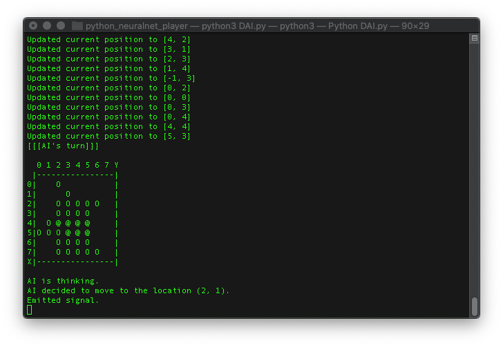

# ReversiTalk
A reversi game stack that can be controlled by various IoT devices, and can be displayed on the webpage. The AI agent uses CNN model, and the library was written purely in NumPy. It was my second year undergrad project.

Link: [http://tapiocafox.github.io/ReversiTalk](http://tapiocafox.github.io/ReversiTalk)

# gallery

